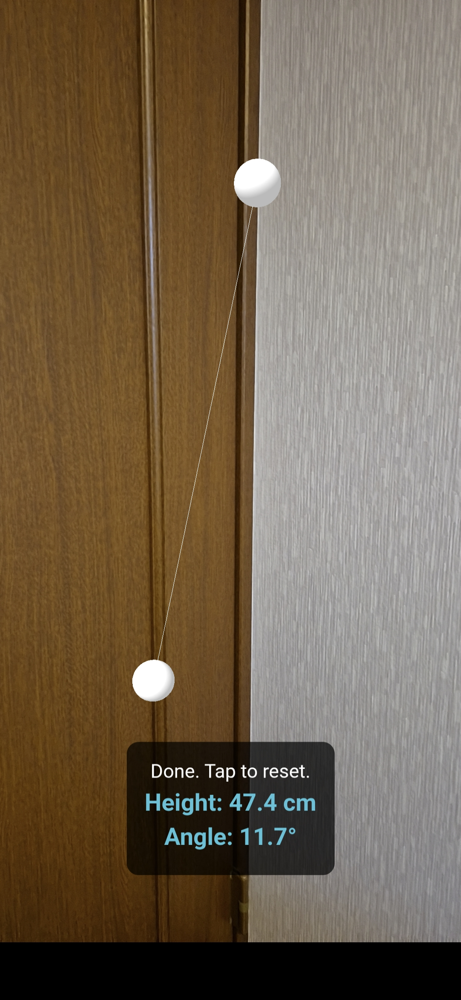
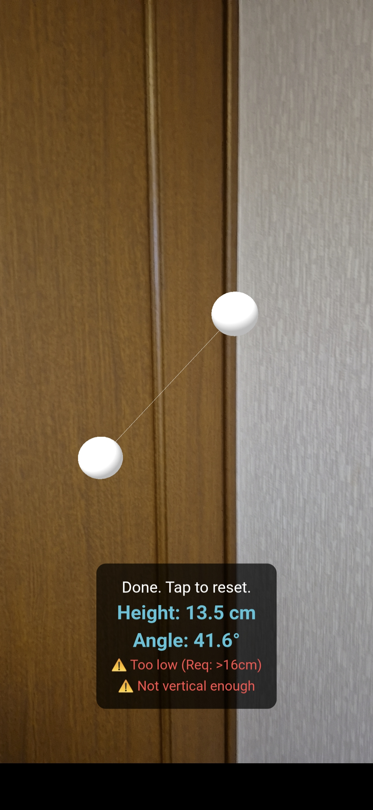

# TT Toss Rule Checker 🏓

TT Toss Rule Checker is an Augmented Reality (AR) application designed to verify the legality of a table tennis service toss.

According to ITTF regulations, the ball must be tossed nearly vertically (within 30 degrees) upward at least 16cm. This app helps players and umpires visualize and measure these metrics using their smartphone camera.

## Development Goals
- Complete the iOS app
- Complete the Android app

🚧 Project Status

Web (WebAR): ✅ Active

iOS App: 🚧 Under Development

Android App: 🚧 Under Development

## 📖 How to Use (Web Version)

Launch the WebAR application in your browser.

Follow the on-screen instructions.

Step 1: Align your smartphone with the release point of the toss and tap the screen.

Step 2: Align your smartphone with the highest point (peak) of the toss and tap the screen.

Step 3: The app will calculate and display the height and the angle of the toss.

A warning will be displayed if the toss violates standard limitations (e.g., height is less than 16cm or the angle deviates more than 30 degrees from vertical).

## Demo

### Legal Serve

### Illegal Serve

🤝 Contributing

We welcome contributions from the community!

If you have experience with Swift (iOS), Kotlin (Android), or cross-platform frameworks like Flutter/React Native, please consider submitting a Pull Request to help us bring this app to native stores.

📄 License

This project is licensed under the MIT License. See the LICENSE file for details.